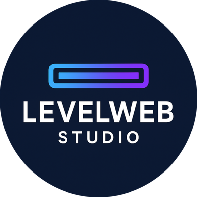

# 🌐 **Portfolio**
**Mon site personnel : présentation de mes projets, de mon activité freelance et de mon profil de programmeur gameplay & moteur**



---

## 📜 **Description du projet**

Ce dépôt contient le code source de mon portfolio, un site statique (HTML/CSS/JS) que j'ai conçu et développé moi-même, sans framework.

👉 **[hugoflandrin.github.io/Portfolio](https://hugoflandrin.github.io/Portfolio/)**

L'objectif est de centraliser en un seul endroit tout ce que je fais : mes projets personnels (moteurs de jeu en C++, prototypes Unreal Engine, prototypes Unity), mon activité freelance via **LevelWeb Studio**, et mon profil de programmeur gameplay / moteur.

C'est aussi un projet à part entière : au-delà de présenter mon travail, le site lui-même sert de démonstration concrète de mes compétences front-end (traduction FR/EN, animations, curseur personnalisé, intégration de démos jouables directement dans le navigateur).

---

## 📦 **Contenu du dépôt**

```
├── index.html                   # Page d'accueil
├── styles.css                   # Styles de la page d'accueil
├── pages/                       # Une page par projet, prototype ou section
│   ├── all-work.html            # Vue d'ensemble de tous les projets
│   ├── LevelWeb-Studio.html     # Présentation de mon activité freelance
│   └── ...                      # Escape, Life Awake, NightLife, 2D/3D Game Engine, etc.
├── static/
│   ├── css/                     # Styles des pages projet
│   ├── js/                      # Logique du site (traduction, navigation, animations, jeux embarqués)
│   ├── img/                     # Images et captures d'écran
│   ├── mp4/                     # Vidéos de démonstration des projets
│   ├── game/ & shmup/           # Builds WebAssembly jouables directement dans le navigateur
│   └── resume/                  # Mon CV
└── 2DGameEngineDemo/            # Code source C++ du moteur 2D affiché sur le site
```

---

## 🛠️ **Technologies utilisées**
- **Langages** : HTML, CSS, JavaScript
- **Pas de framework** : site statique, traduction et animations codées à la main
- **Démos jouables** : compilation en WebAssembly du moteur C++ (voir `2DGameEngineDemo/`)

---

## 🧑‍💻 **Auteur**
Développé et maintenu par **Hugo Flandrin**.

### 🚀 **[Visiter le portfolio](https://hugoflandrin.github.io/Portfolio/)**
